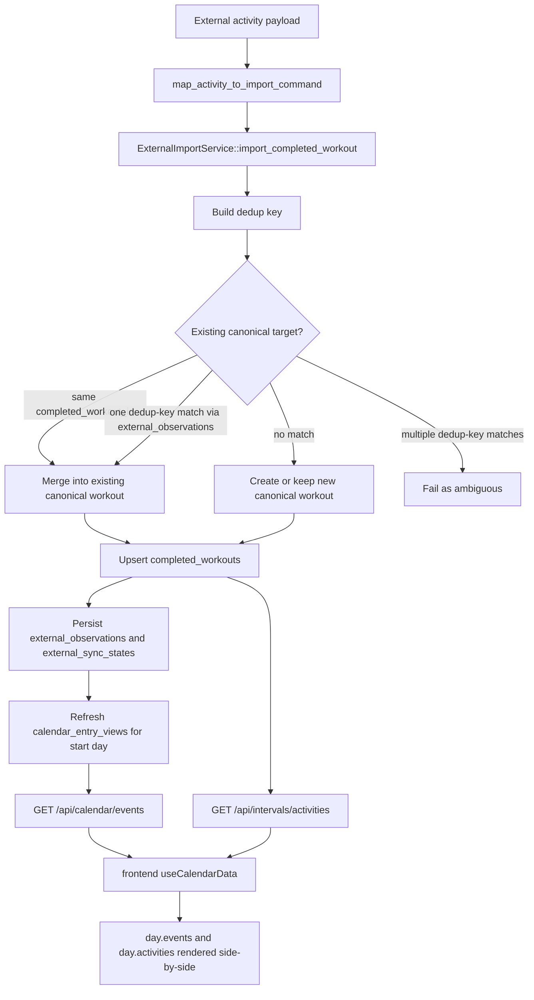

# Completed Workout Dedup And Rendering

This document describes the current code as it exists today.

It explains two things:

- how completed-workout deduplication currently works during external import
- what the frontend currently renders when a planned workout exists locally and a completed workout later arrives from Intervals

## Scope

This document covers:

- canonical completed-workout import in `src/domain/external_sync/import/mod.rs`
- dedup key generation in `src/domain/external_sync/import/completed_workout_dedup.rs`
- frontend calendar composition in `frontend/src/features/calendar/hooks/useCalendarData.ts`
- frontend day-item rendering in `frontend/src/features/calendar/dayItems.ts`

It does not describe intended future behavior. It only describes the current implementation.

## Where Dedup Happens

Completed-workout dedup happens only when an external completed workout is imported into canonical local state.

Relevant path:

- `src/adapters/intervals_icu/import_mapping.rs`
- `src/domain/external_sync/import/mod.rs`
- `src/domain/external_sync/import/completed_workout_dedup.rs`

The import flow is:

1. An external activity is mapped into `ExternalImportCommand::UpsertCompletedWorkout`.
2. `ExternalImportService::import_completed_workout()` computes a dedup key for the incoming canonical `CompletedWorkout`.
3. `resolve_completed_workout_target()` decides whether to:
   - update an existing canonical completed workout, or
   - keep the incoming workout as a new canonical row.
4. The chosen canonical workout is upserted into `completed_workouts`.
5. Sync metadata is persisted.
6. `calendar_entry_views` is refreshed for the workout start day.

## Flow Diagram



## Dedup Matching Order

`resolve_completed_workout_target()` uses this order:

1. Direct canonical id match
2. Dedup-key match through `external_observations`
3. Otherwise create or keep a separate canonical workout

### 1. Direct canonical id match

If an existing stored workout already has the same `completed_workout_id` as the incoming row, the importer merges the incoming data into that row.

This is the simplest path and does not depend on the dedup key.

### 2. Dedup-key match

If there is no direct canonical id match, the importer uses the dedup key.

The dedup key is stored in `external_observations`, not in the `completed_workouts` document itself.

The importer:

1. computes the incoming dedup key
2. looks up `external_observations` for:
   - the same user
   - `ExternalObjectKind::CompletedWorkout`
   - the same dedup key
3. extracts the canonical completed-workout ids referenced by those observations
4. removes duplicates from the id list

Then it behaves like this:

- no matches: treat the incoming workout as a new canonical row
- exactly one canonical match: merge into that canonical workout
- more than one canonical match: fail the import as ambiguous

The ambiguous case is intentional. The code prefers a visible failure over silently merging the workout into the wrong canonical row.

## How The Dedup Key Is Built

The current dedup key format is built in `completed_workout_dedup_key()` and looks like:

```text
v1:<start_bucket>|<rounded_duration>|<rounded_distance>|<stream_bucket>
```

The parts are:

### Start bucket

- derived from `start_date_local`
- bucketed to a minute-level key via `start_minute_bucket(...)`

This means tiny timestamp differences inside the same minute do not matter.

### Rounded duration

Duration is derived from the best available workout detail data, using this order:

1. max interval-group elapsed or moving time
2. max interval elapsed or moving time
3. sample count from streams

Then the duration is rounded with `round_duration_bucket(...)`.

Important current limitation:

- the dedup helper currently does not fall back to top-level `CompletedWorkout.duration_seconds`
- if details are sparse and no usable groups, intervals, or streams exist, the dedup key may be missing

### Rounded distance

Distance is derived from the best available detail data, using this order:

1. max interval-group distance
2. max interval distance
3. last numeric value from a `distance` or `dist` stream

Then the distance is rounded with `round_distance_bucket(...)`.

Important current limitation:

- the dedup helper currently does not fall back to top-level `CompletedWorkout.distance_meters`

### Stream bucket

The importer collects stream types from `details.streams`, normalizes them to lowercase, sorts them, removes duplicates, and joins them with commas.

Examples:

- `watts,distance,heartrate`
- `none`

This helps distinguish workouts with similar start time and duration but very different detail richness.

## What Gets Merged

If a match is found, `merge_completed_workout(existing, incoming)` keeps the canonical identity and merges data field-by-field.

### Identity fields

These stay from the existing canonical row:

- `completed_workout_id`
- `user_id`

### Simple fields

These prefer incoming data, but fall back to existing values if incoming is empty:

- `planned_workout_id`
- `name`
- `description`
- `activity_type`
- `duration_seconds`
- `distance_meters`

`start_date_local` is taken from the incoming workout.

### Metrics

Each metric field prefers the incoming value, then falls back to the existing value.

Examples:

- `training_stress_score`
- `normalized_power_watts`
- `intensity_factor`
- `average_power_watts`
- `ftp_watts`

### Detail arrays

For detail collections, the rule is simple:

- if the incoming collection is non-empty, use it
- otherwise keep the existing collection

This applies to:

- `intervals`
- `interval_groups`
- `streams`
- `interval_summary`
- `skyline_chart`
- zone-time arrays

So the merge strategy is not a deep union. It is a preference for richer incoming detail when present.

## What Dedup Does Not Do

The current dedup logic does not:

- deduplicate planned workouts against completed workouts
- hide completed activities in the frontend calendar
- collapse a planned calendar event and a completed activity into one list row on the calendar screen
- infer a completed-workout match purely from a planned workout existing on the same day

Dedup is only about deciding whether two imported completed-workout payloads should map to the same canonical `completed_workouts` row.

## Scenario: Planned Workout Exists, Then Intervals Completed Workout Arrives

This is the current behavior for the specific scenario:

1. the app already has a planned workout for a date
2. later an Intervals completed workout for that date is fetched and imported

There are two separate backend read paths involved.

### Planned workout path

The planned workout appears in calendar events via the local calendar read model:

- canonical `planned_workouts`
- projected into `calendar_entry_views`
- returned by `GET /api/calendar/events`

For planned workouts, the frontend treats a `WORKOUT` event with workout structure as a planned workout item.

### Completed workout path

The completed workout does not appear as a standalone `CalendarEvent` in the current `/api/calendar/events` response.

`CalendarService::list_events()` explicitly skips `CalendarEntryKind::CompletedWorkout` rows.

Instead, completed workouts come from the activities endpoint:

- `GET /api/intervals/activities`

The frontend calendar loads both sources independently:

- `listCalendarEvents(...)`
- `listActivities(...)`

Then `useCalendarData()` groups them by date and stores them separately as:

- `day.events`
- `day.activities`

## What The Screen Renders Today

For that scenario, the calendar day will usually show two separate items:

1. a planned workout item from `day.events`
2. a completed workout item from `day.activities`

Why:

- `buildDayItems()` creates planned items from `day.events`
- `buildDayItems()` also creates completed items from `day.activities`
- the completed item is only linked to an event when `event.actualWorkout?.activityId === activity.id`

That match comes from enriched Intervals event details, not from the local calendar list response.

### Important current detail

The local calendar list endpoint currently returns:

- planned events with `actualWorkout: null`

So range-loaded calendar data does not collapse the planned event and completed activity into one row.

The planned item and completed item both remain visible on the same date.

## What Happens In The Details Modal

When the user clicks:

- the planned item: the UI opens planned-workout details
- the completed item: the UI opens completed-workout details

For the completed item, the selection may also carry a matched event if one is present in the loaded day state.

But during ordinary range loading, the frontend deliberately does not hydrate detailed event or activity data. It uses the list payloads only.

That means the richer planned-vs-actual combined view depends on loading event detail later, not on the initial weekly calendar payload.

## Why The Screen Looks Like That

The current behavior is a result of these choices:

1. planned calendar rows and completed activities are treated as separate read models
2. completed workouts are intentionally removed from `/api/calendar/events`
3. the frontend calendar composes `events` and `activities` side-by-side instead of merging them during week loading
4. a planned/completed relationship is only surfaced when an event carries `actualWorkout.activityId`, which is not populated in the current local calendar list response

So if a planned workout exists and a completed workout later arrives from Intervals, the calendar screen currently shows both because they come from different API sources and are not collapsed together at list-load time.

## Short Summary

Current dedup behavior:

- deduplicates only completed-workout imports against other completed-workout imports
- uses a fingerprint of start minute, rounded duration, rounded distance, and stream types
- merges into one canonical completed workout when exactly one match is found
- fails on ambiguous fingerprint matches

Current rendering behavior for planned-then-completed:

- the planned workout remains visible as a planned calendar item
- the fetched completed workout appears as a separate completed activity item
- they are not automatically collapsed into one item in the week/day list
- this is because the frontend loads `events` and `activities` separately, and `/api/calendar/events` does not currently emit completed workout rows

## Known Gaps

These are important current limitations in the implementation.

### Dedup key can be missing for sparse workouts

The dedup helper currently derives duration and distance from workout details, not from the top-level fields.

That means:

- no fallback to top-level `duration_seconds`
- no fallback to top-level `distance_meters`

If an imported completed workout has sparse or missing detail structures, dedup may not find a key even when the top-level workout fields would have been enough to identify a likely match.

### Dedup only applies to completed-workout imports

The current logic does not connect a planned workout and a completed workout into one canonical entity.

It only decides whether multiple completed-workout imports should reuse the same canonical `completed_workouts` row.

### Calendar rendering does not collapse planned and completed rows

Even when a planned workout and completed activity clearly refer to the same real-world session, the weekly calendar list usually renders both rows separately.

That happens because:

- planned rows come from `/api/calendar/events`
- completed rows come from `/api/intervals/activities`
- current range-loaded calendar events do not carry `actualWorkout` matches

### Detailed planned-vs-actual linking is not available in the list payload

The richer link between a planned workout and an actual activity exists in enriched Intervals event detail paths, not in the current local calendar list payload.

So the list screen cannot reliably collapse the rows during initial range loading.

### Ambiguous dedup matches fail hard

If the same dedup key points to more than one canonical completed workout, the importer rejects the incoming workout as ambiguous.

This is safer than a silent wrong merge, but it means the system currently has no automatic tie-break strategy for ambiguous completed-workout matches.
