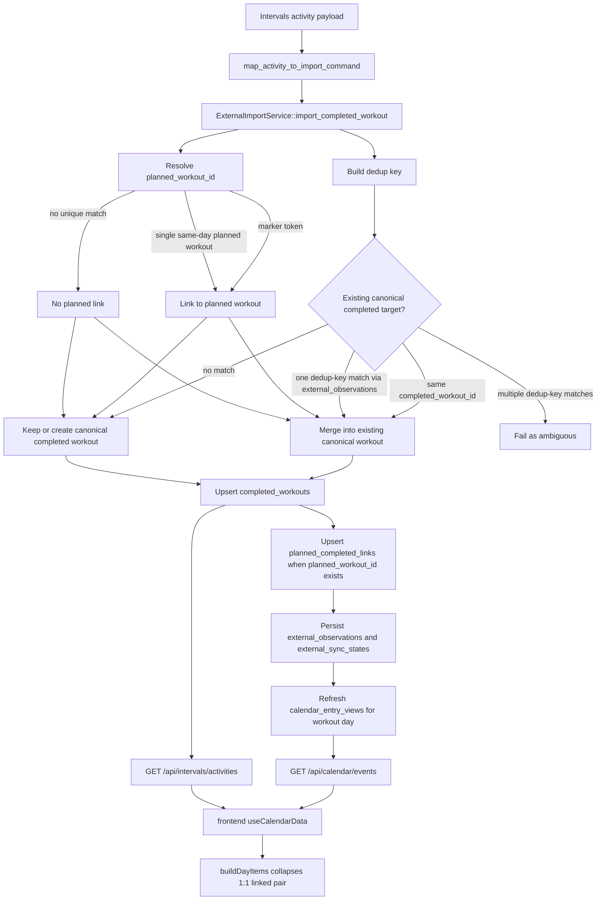

# Completed Workout Dedup And Rendering

This document describes the current code as it exists today.

It explains three related behaviors:

- how completed-workout deduplication works during external import
- how planned and completed workouts are linked during import and rendered on the calendar
- how workout summary identity works for linked planned/completed pairs

## Scope

This document covers:

- Intervals import mapping in `src/adapters/intervals_icu/import_mapping.rs`
- canonical completed-workout import in `src/domain/external_sync/import/mod.rs`
- dedup key generation in `src/domain/external_sync/import/completed_workout_dedup.rs`
- calendar read-model rebuild and refresh in `src/domain/calendar_view/rebuild.rs` and `src/domain/calendar_view/refresh.rs`
- calendar API mapping in `src/domain/calendar/service.rs` and `src/adapters/rest/calendar/*`
- frontend calendar composition in `frontend/src/features/calendar/hooks/useCalendarData.ts` and `frontend/src/features/calendar/dayItems.ts`
- coach list and summary targeting in `frontend/src/features/coach/hooks/useWorkoutList.ts` and `src/domain/workout_summary/service/*`

It does not describe intended future behavior. It only describes the current implementation.

## Import Pipeline

Completed-workout dedup still happens only when an external completed workout is imported into canonical local state.

Relevant path:

- `src/adapters/intervals_icu/import_mapping.rs`
- `src/domain/external_sync/import/mod.rs`
- `src/domain/external_sync/import/completed_workout_dedup.rs`

The import flow is:

1. An Intervals activity is mapped into `ExternalImportCommand::UpsertCompletedWorkout`.
2. `map_activity_to_import_command(...)` builds a canonical `CompletedWorkout` with:
   - `completed_workout_id = intervals-activity:<activity-id>`
   - top-level duration and distance copied from the activity payload
   - `marker_sources` collected from `external_id`, `description`, and `name`
3. `ExternalImportService::import_completed_workout()` computes a dedup key for the incoming canonical workout.
4. The importer tries to resolve a linked `planned_workout_id` for the incoming completed workout.
5. The importer resolves the canonical completed-workout target:
   - merge into an existing canonical completed workout, or
   - keep the incoming workout as a new canonical row.
6. The chosen canonical completed workout is upserted into `completed_workouts`.
7. If the canonical completed workout has a `planned_workout_id`, the importer upserts a durable row into `planned_completed_links`.
8. External observations and sync state are persisted.
9. `calendar_entry_views` is refreshed for the completed workout day.

## Flow Diagram



## Dedup Matching Order

`resolve_completed_workout_target()` uses this order:

1. Direct canonical id match
2. Dedup-key match through `external_observations`
3. Otherwise create or keep a separate canonical completed workout

### 1. Direct canonical id match

If an existing stored workout already has the same `completed_workout_id` as the incoming row, the importer merges the incoming data into that row.

This is the simplest path and does not depend on the dedup key.

### 2. Dedup-key match

If there is no direct canonical id match, the importer uses the dedup key.

The dedup key is stored in `external_observations`, not in the `completed_workouts` document itself.

The importer:

1. computes the incoming dedup key
2. looks up `external_observations` for:
   - the same user
   - `ExternalObjectKind::CompletedWorkout`
   - the same dedup key
3. extracts the canonical completed-workout ids referenced by those observations
4. removes duplicates from the id list

Then it behaves like this:

- no matches: treat the incoming workout as a new canonical row
- exactly one canonical match: merge into that canonical workout
- more than one canonical match: fail the import as ambiguous

The ambiguous case is intentional. The code prefers a visible failure over silently merging the workout into the wrong canonical row.

## Planned-Completed Linking During Import

In addition to completed-vs-completed dedup, the importer now tries to attach an imported completed workout to a planned workout.

That happens in `resolve_planned_workout_id_for_completed_workout()`.

The linking order is:

1. Marker-based lookup
2. Single same-day planned workout fallback
3. Otherwise no planned link

### 1. Marker-based lookup

The importer scans `marker_sources` extracted from the Intervals activity payload.

Today those sources are:

- `activity.external_id`
- `activity.description`
- `activity.name`

If one of them contains an `[AIWATTCOACH:pw=<token>]` marker, the importer looks up the token in `planned_workout_tokens` and resolves the linked `planned_workout_id`.

### 2. Single same-day planned workout fallback

If no marker resolves, the importer loads planned workouts for the completed workout day.

If there is exactly one planned workout on that day, the importer links the completed workout to that `planned_workout_id`.

If there are zero or multiple same-day planned workouts, the importer does not infer a link.

### 3. Persisted link shape

If the canonical completed workout ends up with a `planned_workout_id`, the importer:

- stores that `planned_workout_id` on the canonical `CompletedWorkout`
- upserts a durable `planned_completed_links` row

The current calendar merge path uses `CompletedWorkout.planned_workout_id` directly. The separate link repository is also persisted as durable linkage metadata.

## How The Dedup Key Is Built

The current dedup key format is built in `completed_workout_dedup_key()` and looks like:

```text
v1:<start_bucket>|<rounded_duration>|<rounded_distance>|<stream_bucket>
```

The parts are:

### Start bucket

- derived from `start_date_local`
- bucketed to a minute-level key via `start_minute_bucket(...)`

This means tiny timestamp differences inside the same minute do not matter.

### Rounded duration

Duration is derived from the best available workout detail data, using this order:

1. max interval-group elapsed or moving time
2. max interval elapsed or moving time
3. sample count from streams

Then the duration is rounded with `round_duration_bucket(...)`.

Important current limitation:

- the dedup helper does not fall back to top-level `CompletedWorkout.duration_seconds`
- if details are sparse and no usable groups, intervals, or streams exist, the dedup key may be missing

### Rounded distance

Distance is derived from the best available detail data, using this order:

1. max interval-group distance
2. max interval distance
3. last numeric value from a `distance` or `dist` stream

Then the distance is rounded with `round_distance_bucket(...)`.

Important current limitation:

- the dedup helper does not fall back to top-level `CompletedWorkout.distance_meters`

### Stream bucket

The importer collects stream types from `details.streams`, normalizes them to lowercase, sorts them, removes duplicates, and joins them with commas.

Examples:

- `watts,distance,heartrate`
- `none`

This helps distinguish workouts with similar start time and duration but very different detail richness.

## What Gets Merged

If a match is found, `merge_completed_workout(existing, incoming)` keeps the canonical identity and merges data field-by-field.

### Identity fields

These stay from the existing canonical row:

- `completed_workout_id`
- `user_id`

### Simple fields

These prefer incoming data, but fall back to existing values if incoming is empty:

- `planned_workout_id`
- `name`
- `description`
- `activity_type`
- `duration_seconds`
- `distance_meters`

`start_date_local` is taken from the incoming workout.

This is important for linking: if the incoming activity resolves a `planned_workout_id`, a previously stored canonical completed workout can gain that planned link during merge.

### Metrics

Each metric field prefers the incoming value, then falls back to the existing value.

Examples:

- `training_stress_score`
- `normalized_power_watts`
- `intensity_factor`
- `average_power_watts`
- `ftp_watts`

### Detail arrays

For detail collections, the rule is simple:

- if the incoming collection is non-empty, use it
- otherwise keep the existing collection

This applies to:

- `intervals`
- `interval_groups`
- `streams`
- `interval_summary`
- `skyline_chart`
- zone-time arrays

So the merge strategy is not a deep union. It is a preference for richer incoming detail when present.

## Calendar Read Model

The calendar read model now merges planned and completed workouts for rendering.

Relevant path:

- `src/domain/calendar_view/rebuild.rs`
- `src/domain/calendar_view/refresh.rs`

`merge_workout_entries(...)` starts from projected planned-workout entries and then inspects completed workouts grouped by `planned_workout_id`.

For each `planned_workout_id`:

- if exactly one completed workout points to that planned workout and a planned entry exists:
  - the planned entry gets `completed_workout_id`
  - the planned entry gets the completed-workout summary payload
  - the planned entry backfills description from the completed entry if needed
  - the standalone completed entry is suppressed from the read model
- otherwise:
  - the planned entry stays unmerged
  - the completed workout remains a standalone completed-workout entry in the read model

This means the read model collapses only the simple 1:1 linked case.

## Calendar API Behavior

`CalendarService::list_events()` still does not emit standalone completed-workout entries from `calendar_entry_views`.

That filter is still here:

- `CalendarEntryKind::CompletedWorkout => return None`

But the API now also loads canonical completed workouts for the requested date range and uses them to enrich planned events.

When a projected calendar entry has `completed_workout_id`, `map_calendar_entry_to_event(...)` sets:

- `CalendarEvent.actual_workout`

The `actual_workout.activity_id` is derived from the canonical completed-workout id by stripping the `intervals-activity:` prefix.

So the current `/api/calendar/events` behavior is:

- standalone completed rows are still omitted
- linked planned rows are returned
- linked planned rows can now carry `actualWorkout`

## Frontend Calendar Rendering

The frontend still loads three sources independently:

- `listCalendarEvents(...)`
- `listActivities(...)`
- `listCalendarLabels(...)`

`useCalendarData()` groups them by day into:

- `day.events`
- `day.activities`
- `day.labels`

The key change is in `buildDayItems()`.

### Planned item behavior

For a planned workout event:

- the frontend looks at `event.actualWorkout?.activityId`
- if that id matches a loaded activity for the day, the planned item carries that activity in `item.activity`

So a linked planned row can render as a planned workout with attached actual/completed workout context.

### Completed item suppression

For each activity:

- the frontend looks for a matching event where `event.actualWorkout?.activityId === activity.id`
- if that matched event is a planned workout event, the standalone completed day item is skipped

This is what collapses the visible day list for the 1:1 linked case.

### Resulting day-list behavior

If a planned workout exists and exactly one completed workout links to it:

- the day usually shows one planned item
- that planned item carries the matched completed activity
- the separate completed item is suppressed

If there is no link, or the backend could not collapse the pair into a 1:1 planned/completed relationship:

- the planned item and completed activity can still appear separately

## Details Modal Behavior

When the user clicks a linked planned row on the calendar:

- `selectDayItemDetail(...)` returns both the planned event and the matched activity

So the details modal can render a combined planned-vs-actual view directly from the list payloads in the linked case.

## Coach Summary Identity

The coach page now treats linked planned/completed pairs as activity-backed items for summary purposes.

Relevant path:

- `frontend/src/features/coach/hooks/useWorkoutList.ts`
- `src/domain/workout_summary/service/mod.rs`
- `src/domain/workout_summary/service/use_cases.rs`

Current behavior:

- the coach list matches activities to events using `event.actualWorkout.activityId` first
- linked rows use `activity.id` as the stable item identity
- summary batch loading is requested only for completed `activity.id` values
- single-summary operations validate that the target is a completed workout
- batch listing filters out non-completed ids instead of failing the whole batch

The practical rule is:

- summary, chat, RPE, save, and recap are only for completed activities
- planned workout ids and event ids are not valid workout summary targets
- a linked planned workout is only context for the completed activity, not a separate summary identity

## What Dedup And Linking Do Not Do

The current implementation still does not:

- turn planned workouts and completed workouts into one shared canonical domain entity
- collapse ambiguous or one-to-many planned/completed relationships into a single rendered row
- create workout summaries for planned workouts
- use `planned_completed_links` as the primary source for calendar rendering

Completed-workout dedup still decides only whether multiple completed-workout payloads should reuse the same canonical `completed_workouts` row.

Planned/completed rendering collapse is a separate read-model and UI behavior built on top of `CompletedWorkout.planned_workout_id` plus `actualWorkout` hydration.

## Short Summary

Current completed-workout dedup behavior:

- deduplicates only completed-workout imports against other completed-workout imports
- uses a fingerprint of start minute, rounded duration, rounded distance, and stream types
- merges into one canonical completed workout when exactly one match is found
- fails on ambiguous fingerprint matches

Current planned/completed linking behavior:

- tries marker-based matching first
- falls back to linking to exactly one same-day planned workout
- stores the resolved `planned_workout_id` on the canonical completed workout
- persists a durable `planned_completed_links` row

Current calendar rendering behavior for a 1:1 linked pair:

- the backend projects the planned row with `completed_workout_id`
- `/api/calendar/events` returns the planned event with `actualWorkout`
- the frontend renders one planned item with attached completed activity context
- the standalone completed calendar item is suppressed

Current coach summary behavior:

- the linked pair is summary-targeted only through the completed activity id
- planned/event ids are not valid summary targets

## Known Gaps

These are important current limitations in the implementation.

### Dedup key can be missing for sparse workouts

The dedup helper currently derives duration and distance from workout details, not from the top-level fields.

That means:

- no fallback to top-level `duration_seconds`
- no fallback to top-level `distance_meters`

If an imported completed workout has sparse or missing detail structures, dedup may not find a key even when the top-level workout fields would have been enough to identify a likely match.

### Same-day fallback links only when there is exactly one planned workout

If multiple planned workouts exist on the same day and no marker resolves, the importer leaves `planned_workout_id` unset.

That avoids guessing, but it also means some legitimate planned/completed pairs will stay unlinked until a marker-based path exists.

### Calendar collapse only handles the 1:1 linked case

`merge_workout_entries(...)` only merges when exactly one completed workout points to a planned workout and the planned entry exists.

If there are multiple completed workouts for the same planned workout, or no planned entry exists in the refreshed range, the list falls back to separate planned and completed representations.

### Standalone completed calendar entries are still filtered out of `/api/calendar/events`

Completed-workout entries can exist in `calendar_entry_views`, but `CalendarService::list_events()` still does not emit them directly.

The frontend relies on `/api/intervals/activities` for completed-workout list data.

### Planned workouts never own summaries

This is intentional current behavior, not an accident.

Workout summaries are only available for completed activities. Linked planned workouts act as context only.
