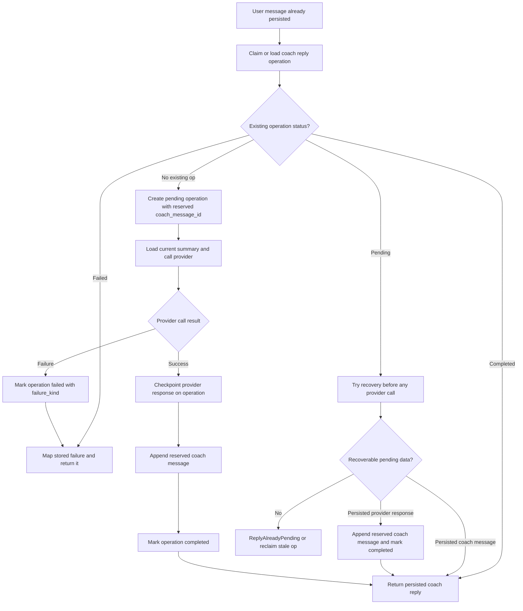
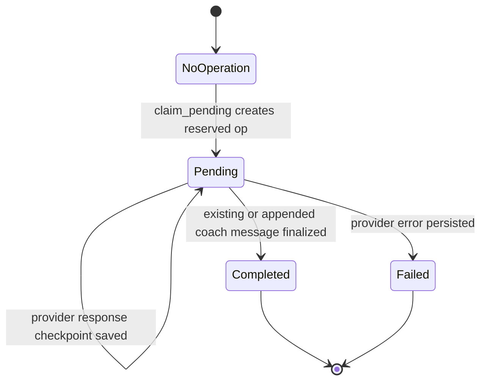
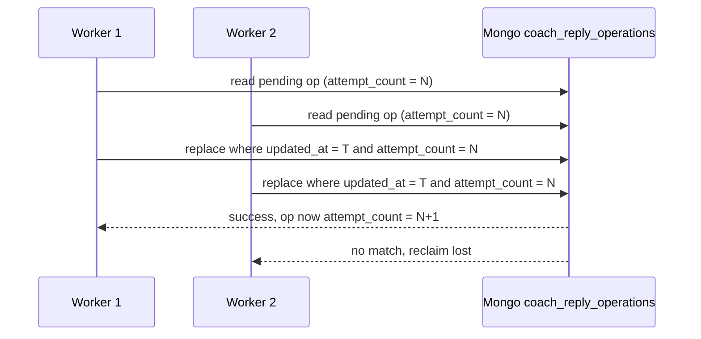

# LLM Coach Reply State Machine

This document explains how workout-summary coach replies move through durable states, how local write retries work, and how recovery avoids duplicate LLM calls.

## Scope

This state machine describes the backend workflow centered around:

- `WorkoutSummaryService::generate_coach_reply`
- `CoachReplyOperation`
- persisted workout-summary messages
- persisted LLM provider response checkpoints

It does not describe provider-specific HTTP details. It describes the durable workflow used to make retries and crash recovery safe.

## High-Level Flow

## Durable States

## Pending State Meaning

`Pending` is not a single in-memory step. It can represent several durable checkpoints:

- reserved `coach_message_id` exists, but no provider response yet
- provider response is already checkpointed in `response_message`
- coach message was already appended, but completion upsert failed

That distinction matters because retries must inspect the stored operation before calling the provider again.

## Recovery Rules

On every `generate_coach_reply` call, the service checks for reusable durable state in this order:

1. If the operation is `Completed`, return the already persisted coach message.
2. If the operation is `Failed`, map the stored failure and return it.
3. If the operation is `Pending` and the reserved `coach_message_id` already exists in the summary, mark the operation completed from that message and return it.
4. If the operation is `Pending` and `response_message` is already checkpointed, append the reserved coach message, mark completed, and return it.
5. Only if none of those recovery paths apply should the service treat the work as still pending or make a fresh provider call.

## Same-Request Local Write Retries

After the provider has already returned, the service now retries transient local `reply_operations.upsert(...)` failures inside the same request before surfacing an error.

That retry is intentionally narrow:

- it applies only to post-provider operation writes
- it does not retry the external provider call itself
- it does not change the durable recovery order on later requests

This reduces the chance that a brief repository blip turns a completed provider call into a user-visible failure.

## Retry And Reclaim Behavior

Stale `Pending` operations can be reclaimed. Reclaim uses a compare-and-swap predicate in Mongo so only one worker wins.

The reclaim filter matches both:

- `updated_at_epoch_seconds`
- `attempt_count`

`attempt_count` acts as the optimistic-lock version token. If two workers read the same stale row, only one can replace it with `attempt_count + 1`.

This prevents duplicate provider calls caused by concurrent reclaim attempts.

## Failure Handling

Provider failures are persisted as `Failed` operations with a stored `failure_kind` and optional message.

If an older or partial failed record is missing `failure_kind`, the service falls back to:

- `WorkoutSummaryError::Llm(LlmError::Internal(error_message))`

That avoids turning a stored provider failure into a repository error during recovery.

## Partial Failure Windows

The workflow currently handles these important windows safely:

1. Provider reply succeeded, the first checkpoint write fails transiently, and the same request retries the checkpoint locally.
2. Provider fails and the initial failed-state write hits a transient repository error; the same request retries that write locally before returning the original LLM error.
3. Provider reply succeeded and was checkpointed, but appending the coach message failed.
4. Coach message append succeeded, but marking the operation `Completed` failed.
5. A later retry sees the durable pending state and finalizes from stored data instead of re-calling the provider.

## Still Deferred

The current workflow is more resilient to transient local repository failures, but it is still not a fully durable workflow engine.

Examples still outside the current guarantees:

- process crash between the provider returning and the successful retry of the first local checkpoint write
- longer repository outages that outlive the bounded in-request retry window
- any future requirement for durable outbox-style replay across process restarts without relying on the current request path

Those cases would require a broader checkpointing or workflow redesign beyond the current bounded retry and replay model.
