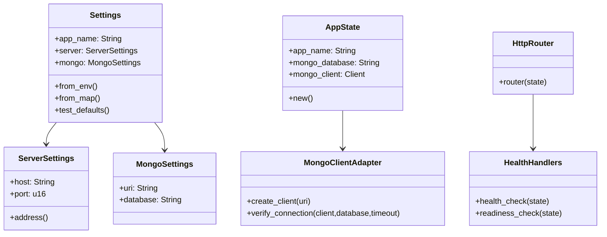
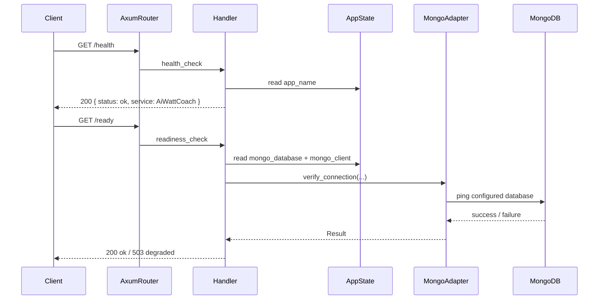
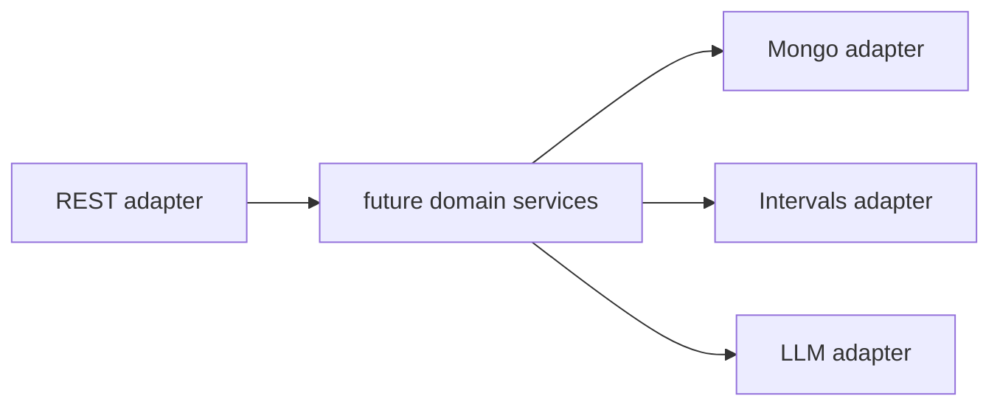

# AiWattCoach Architecture

## Purpose

`AiWattCoach` is a Rust backend that is being shaped toward a hexagonal architecture. The current codebase is still a bootstrap slice, but the structure is already prepared for three main integration directions:

- importing completed workouts from Intervals.icu
- generating future plans with LLM providers
- publishing planned workouts back through Intervals for downstream device sync

The current implementation provides application bootstrap, configuration loading, MongoDB connectivity verification, and operational endpoints for liveness/readiness. It does not yet contain real domain services or ports.

## Current High-Level Structure

```mermaid
flowchart LR
    A[main.rs] --> B[config::Settings]
    A --> C[adapters::mongo::client]
    A --> D[config::AppState]
    D --> E[config::http::build_app]
    E --> F[adapters::rest::router]
    F --> G[/health]
    F --> H[/ready]
    H --> C
```

## Module Responsibilities



## Current Request Flow



## Exposed Adapters

### REST adapter

Files:

- `src/adapters/rest/mod.rs`
- `src/adapters/rest/health.rs`

Responsibilities:

- define the HTTP routes
- keep handlers thin
- map internal application state into JSON responses

Currently exposed endpoints:

| Method | Path | Purpose | Response |
|---|---|---|---|
| `GET` | `/health` | liveness probe | `200 OK` with service metadata |
| `GET` | `/ready` | readiness probe against configured Mongo database | `200 OK` or `503 Service Unavailable` |

### Mongo adapter

Files:

- `src/adapters/mongo/client.rs`

Responsibilities:

- create a MongoDB client from a URI
- verify that the configured Mongo database is reachable within a bounded timeout

### Config/bootstrap layer

Files:

- `src/main.rs`
- `src/config/settings.rs`
- `src/config/app_state.rs`
- `src/config/http.rs`

Responsibilities:

- load env-based configuration
- validate required settings
- fail fast if Mongo cannot be reached on startup
- build Axum app state and router
- start the server and handle graceful shutdown

## Current API Contract

### `GET /health`

Example response:

```json
{
  "status": "ok",
  "service": "AiWattCoach"
}
```

This endpoint is for liveness only. It does not claim downstream dependency health.

### `GET /ready`

Healthy example:

```json
{
  "status": "ok",
  "reason": null
}
```

Degraded example:

```json
{
  "status": "degraded",
  "reason": "mongo_unreachable"
}
```

This endpoint checks the configured Mongo database using a short timeout.

## Current Data Model and Planned Collections

The current bootstrap does not yet persist domain entities, but the application already knows which database it will use through `MONGODB_DATABASE`.

Planned collections:

```mermaid
erDiagram
    USER_PROFILES {
        objectId _id
        string athlete_id
        int ftp
        int age
        float weight_kg
        array medications
        string notes
        datetime updated_at
    }

    WORKOUTS {
        objectId _id
        string source
        string external_id
        datetime start_time
        string workout_type
        int duration_seconds
        float normalized_power
        float training_load
        float efficiency_factor
        datetime imported_at
    }

    PLANNED_WORKOUTS {
        objectId _id
        string external_push_id
        datetime scheduled_for
        string title
        string intervals_definition
        string status
        datetime created_at
    }

    CHAT_SESSIONS {
        objectId _id
        string athlete_id
        array messages
        datetime expires_at
        datetime created_at
    }

    USER_PROFILES ||--o{ CHAT_SESSIONS : owns
    USER_PROFILES ||--o{ WORKOUTS : trains
    USER_PROFILES ||--o{ PLANNED_WORKOUTS : receives
}
```

### Collection intent

- `user_profiles`: athlete setup used for AI prompting
- `workouts`: normalized imported workout history from Intervals.icu
- `planned_workouts`: generated or manually created future workouts
- `chat_sessions`: persisted AI conversations with TTL expiry

## Planned Adapter Expansion



Planned external adapters:

- `src/adapters/intervals/*` for activity sync and planned workout push
- `src/adapters/llm/*` for provider-specific AI integration

## Architectural Rules Applied Here

- startup verifies local config and Mongo before serving traffic
- liveness and readiness are separated
- HTTP handlers remain thin
- Mongo access is isolated behind the adapter layer
- app state carries only the runtime values handlers actually need

## Current Architectural Reality

- `config/*` and `adapters/*` are real and active
- the domain layer is still only a placeholder for future business modules
- there are no ports or use-case services yet
- this document therefore describes both the current bootstrap and the intended next structure

## Current Limitations

- no domain services yet; bootstrap only
- no persistence repositories yet
- no write endpoints yet
- no Intervals.icu or LLM adapters yet

## Next Natural Architectural Steps

1. Add `intervals` adapter with typed client and import service.
2. Introduce first real domain context for workouts.
3. Add Mongo repository modules per collection instead of a single client-only adapter.
4. Add OpenAPI or endpoint docs once API surface grows beyond operational probes.
