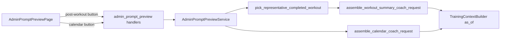

# Admin Prompt Preview (dual surface)

**Goal:** Admin page with date (today or earlier), `userId`, and **two preview actions** that show the full assembled LLM request (pretty-printed JSON) without calling a provider.

| Button | Product surface | Code path |
| --- | --- | --- |
| **Preview post-workout request** | AI Coach (completed workout chat) | `LlmWorkoutCoach` / `workout_summary_coach.rs` — `ToolScope::WorkoutSummaryChat` |
| **Preview calendar view coach** | Calendar → AI coach (general coaching) | `prepare_calendar_llm_request` — `ToolScope::CalendarCoachChat` |

**Non-goals:** Live LLM calls, editing prompts, training-plan / athlete-summary previews, persisting admin previews.

---

## Shared rules

| Topic | Decision |
| --- | --- |
| Date | `YYYY-MM-DD`, `is_valid_date`, `date <= today` (UTC, same as admin backfill) |
| As-of time | Clock frozen to **end of selected UTC day** (`23:59:59`) for `conversation_timing`, `today` in tool context, and calendar overview `focus_date` |
| User | Required `userId` field (pattern: `/api/admin/settings/{user_id}`) |
| JSON UI | `JSON.stringify(payload, null, 2)` in large scrollable `<pre>` |
| Auth | Session + `require_admin` |
| Conversation in preview | **Synthetic placeholder** unless a stored summary/conversation exists (post-workout only) |

Placeholder user line (both surfaces, when no stored messages):

`"Preview: [admin] sample athlete message"`

---

## 1. Preview post-workout request (AI Coach)

### Behaviour

Shows the request that would be sent when the athlete chats about **one completed workout** on the selected day — same assembly as `LlmWorkoutCoach::reply`, but without `run_tool_loop` / `chat`.

### Workout selection (“best match” for the day)

Domain helper: `pick_representative_completed_workout_for_date(user_id, date)`.

| Step | Action |
| --- | --- |
| 1 | `list_by_user_id_and_date_range(user_id, date, date)` |
| 2 | `select_visible_workouts_by_day(..., wahoo_entity_ids)` — same dedupe as calendar visibility (`src/domain/completed_workouts/selection.rs`) |
| 3 | 0 workouts → **404** `no_completed_workout_for_date` |
| 4 | 1 workout → use it |
| 5 | Multiple | Score planned↔completed pairs using existing **`find_best_activity_match`** (`src/domain/intervals/workout/matching.rs`) + **`build_event_activity_matches`** pattern (`src/domain/training_context/service/context.rs`): load workout-category events + map completed rows to `Activity` for that day, take **max `compliance_score`** across pairs |
| 6 | No pair ≥ 0.45 | Fallback: highest `training_stress_score`, then latest `start_date_local` |
| 7 | Resolve canonical id via `CompletedWorkoutTargetService` → `preferred_workout_id` for `workout_id` in summary |

Response `meta` includes selection diagnostics:

```json
{
  "selectedWorkoutId": "...",
  "selectionMethod": "compliance_match | single_workout | tss_fallback | latest_start_fallback",
  "complianceScore": 0.92
}
```

### Training context & summary payload

- `training_context_builder.build(user_id, &workout_id)` with **`as_of_date = selected date`** so `focus_date` is that day (not real today).
- **Summary source:**
  - If `WorkoutSummaryRepository` has a document → use real `rpe`, `messages`, `provider_transcript` (preview matches ongoing thread).
  - Else → minimal stub: `{ workout_id, rpe: null, messages: [], provider_transcript: [] }` + placeholder user message (simulates first post-workout coach turn).
- **Athlete summary text:** read current stored summary text if available (`get` / ensure path **without** regeneration); omit field when missing (do not trigger LLM regen in preview).

### Refactor

Extract from `workout_summary_coach.rs` (move builders to `src/domain/workout_summary/prompt.rs` or `src/domain/llm/prompt_assembly/workout_summary.rs`):

- `assemble_workout_summary_coach_request(WorkoutSummaryCoachPromptInput) -> LlmChatRequest`
- `LlmWorkoutCoach::reply` calls the helper.

Populate `tools` / `tool_choice` for `ToolScope::WorkoutSummaryChat` like `run_tool_loop` does.

---

## 2. Preview calendar view coach

### Behaviour

Shows the request for **calendar AI coach** — general coaching from calendar view (`build_calendar_overview_context`, calendar system prompt, calendar stable/volatile builders).

Unchanged from original plan except naming:

- `build_calendar_overview_context_as_of(user_id, focus_date)`
- `assemble_calendar_coach_request` extracted from `src/domain/coach_conversation/service/request.rs`
- Synthetic `CoachConversation` (overview focus, empty messages) + placeholder user line
- `ToolScope::CalendarCoachChat` tools included

---

## API

Two explicit routes (maps 1:1 to UI buttons):

```
GET /api/admin/users/{user_id}/prompt-preview/post-workout?date=YYYY-MM-DD
GET /api/admin/users/{user_id}/prompt-preview/calendar-coach?date=YYYY-MM-DD
```

### Response shape (both)

```json
{
  "meta": {
    "userId": "...",
    "date": "2026-05-30",
    "surface": "post_workout | calendar_coach",
    "provider": "...",
    "model": "...",
    "focusDate": "2026-05-30"
  },
  "request": {
    "systemPrompt": "...",
    "stableContext": "...",
    "volatileContext": "...",
    "conversation": [],
    "tools": [],
    "toolChoice": "auto"
  },
  "providerMessages": []
}
```

Post-workout `meta` adds `selectedWorkoutId`, `selectionMethod`, optional `complianceScore`.

### Errors

| Condition | Status |
| --- | --- |
| Not admin | 403 |
| Bad / future date | 400 |
| No completed workout on date (post-workout only) | 404 |
| Service not wired | 503 |
| Build failure | 500 |

---

## Architecture



### Domain module

`src/domain/admin_prompt_preview/` (or `src/domain/llm/prompt_preview/`):

- `ports.rs` — trait `AdminPromptPreviewUseCases`
- `service.rs` — orchestration
- `workout_selection.rs` — day picker (unit-tested)
- Reuses extracted assemblers in `workout_summary` + `coach_conversation`

### Training context change

```rust
fn build_as_of(
    &self,
    user_id: &str,
    workout_id: &str,
    focus_date: NaiveDate,
) -> BoxFuture<Result<TrainingContextBuildResult, LlmError>>;

fn build_calendar_overview_context_as_of(
    &self,
    user_id: &str,
    focus_date: NaiveDate,
) -> BoxFuture<Result<TrainingContextBuildResult, LlmError>>;
```

`build` / `build_calendar_overview_context` keep calling with `as_of: None` (production behaviour).

---

## Frontend

### Route

`/admin/prompt-preview` — admin nav entry (i18n `nav.promptPreview`).

### Controls

1. `userId` text input  
2. `type="date"` with `max={todayUtc}`  
3. **Preview post-workout request** (primary / amber)  
4. **Preview calendar view coach** (secondary / slate)  
5. Shared preview panel — shows last successful response; label which button produced it (`meta.surface`)

### Feature module

- `loadAdminPostWorkoutPromptPreview(apiBaseUrl, userId, date)`
- `loadAdminCalendarCoachPromptPreview(apiBaseUrl, userId, date)`
- Zod schemas + API tests for both paths
- Page test: both buttons call correct URLs; 404 surfaced for empty day on post-workout

---

## Tests

### Backend unit

| Case | Module |
| --- | --- |
| Multiple workouts → highest compliance wins | `workout_selection.rs` |
| No compliance → TSS / latest fallback | same |
| `select_visible_workouts_by_day` respected before scoring | same |
| `build_as_of` sets `focus_date` on overview + workout id | `training_context` |

### Backend integration

| Case | File |
| --- | --- |
| 403 non-admin | `tests/admin_prompt_preview_rest.rs` |
| 400 future date | both routes |
| 404 no workout (post-workout) | post-workout route |
| 200 calendar coach with empty day allowed | calendar route |
| 200 post-workout includes `selectedWorkoutId` | fakes with 2 workouts + scored match |

### Frontend

- API tests (2 endpoints)
- Page: date max, button → pretty JSON, error states

---

## Implementation order

1. `as_of` on `TrainingContextBuilder` + tests  
2. `workout_selection.rs` + tests  
3. Extract `assemble_workout_summary_coach_request` + `assemble_calendar_coach_request`  
4. `AdminPromptPreviewService` + AppState wiring  
5. REST: two handlers + routes  
6. Integration tests  
7. Frontend page + i18n  
8. `verify:arch`, fmt, clippy, targeted tests  

---

## Security

- Admin-only; responses contain PII and full packed context.  
- Do not log response bodies on these routes.  
- No external API cost.

---

## Out of scope

- Training plan / athlete summary preview buttons  
- Pretty-printing JSON *inside* `stableContext` strings  
- Deep-link from task scheduler
